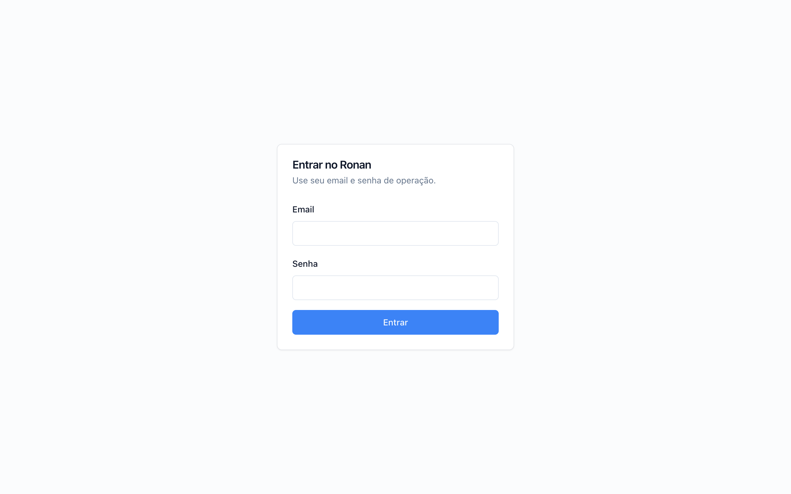
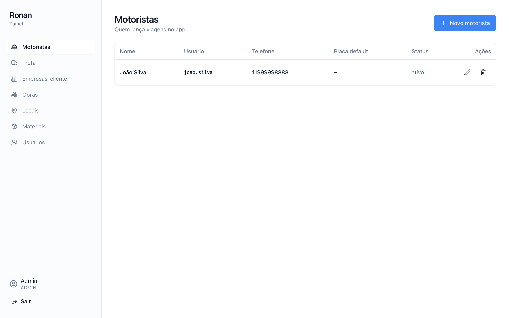
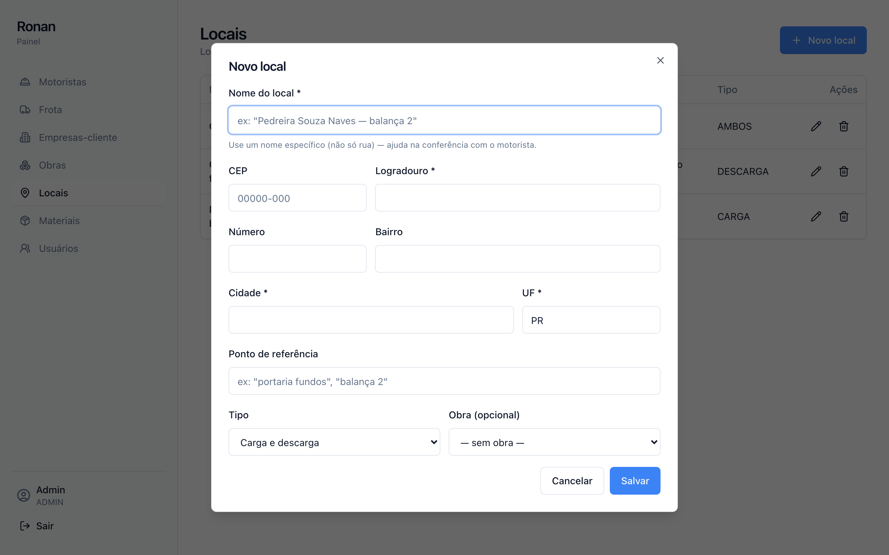
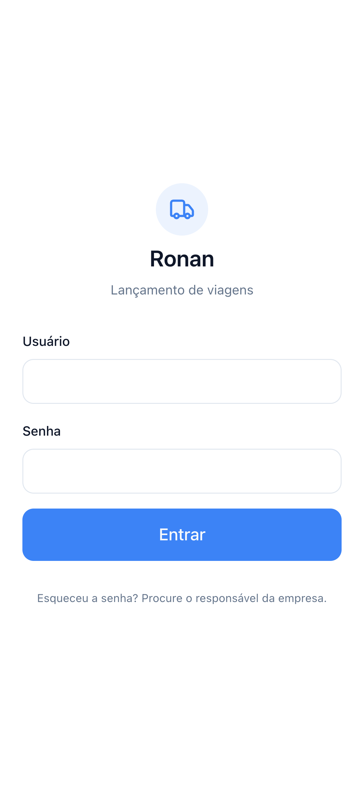
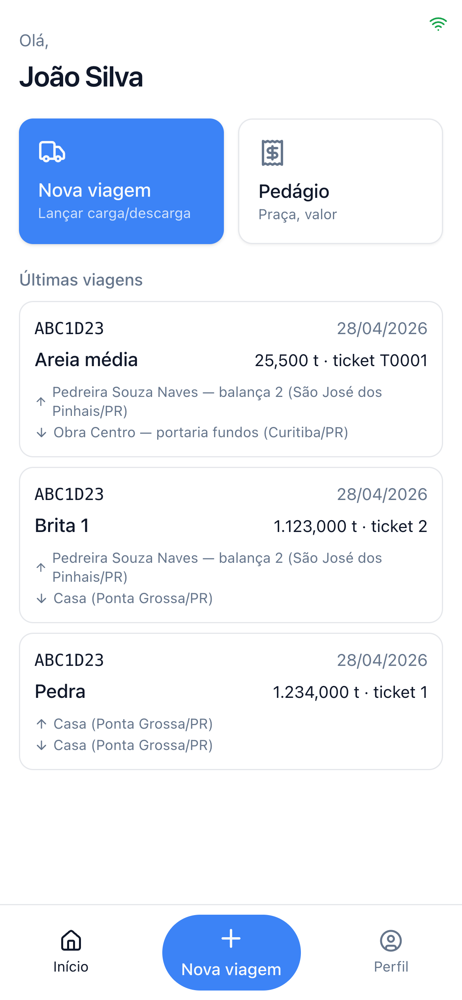
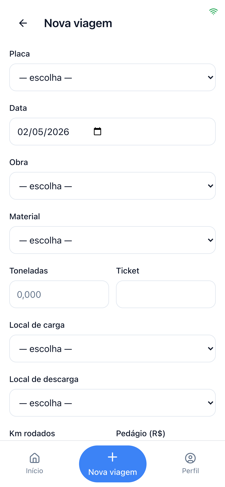

# Proposta Comercial — Sistema Ronan

**Sistema de Lançamento de Viagens e Conciliação para Transportadora**

**Cliente:** Ronan Gebieluca
**Apresentado por:** Diego Davi Orlonski — Turbomind
**Data:** 29 de abril de 2026
**Validade da proposta:** 30 dias

---

## 1. Sobre a proposta

Este documento descreve a solução tecnológica completa para gestão das viagens, lançamentos de pedágio, controle de frota e conciliação com empresas-cliente. O sistema substitui o processo atual baseado em papel e planilhas, eliminando retrabalho, evitando perda de informação e padronizando os dados que circulam entre motorista, escritório e cliente.

A proposta cobre **desenvolvimento completo, hospedagem do primeiro ano e configuração do servidor**, entregando o sistema pronto para uso em produção em até 2 meses corridos.

---

## 2. O problema atual

A operação hoje funciona assim:

- O motorista preenche em papel cada viagem realizada (placa, ticket, toneladas, km, local de carga e descarga, pedágios pagos no caminho).
- Esses papéis chegam ao escritório no fim do mês.
- Uma operadora digita tudo manualmente em planilha Excel.
- A empresa-cliente envia ou recebe planilhas em formatos próprios, e a operadora confere linha a linha se bate com o que o motorista lançou.
- Divergências (km errado, ticket trocado, viagem faltando) só aparecem dias depois e geram retrabalho ou perda de receita.
- Locais ficam descritos com nomes vagos como "Souza Naves", o que dificulta auditoria e novas conferências.

Os custos invisíveis disso:
- **Tempo:** vários dias úteis por mês só de digitação e conferência.
- **Erro humano:** dado escrito em papel + transcrito é o vetor mais comum de divergência.
- **Atraso de fechamento:** o motorista entrega a planilha física só no fim do mês, então qualquer conciliação fica tardia.
- **Sem rastreabilidade:** não há histórico estruturado pra entender produtividade, custo por obra, eficiência por motorista.

---

## 3. A solução proposta

Um sistema sob medida composto por **três aplicações integradas**:

### 3.1 Aplicativo do motorista (PWA — funciona no celular como app)

O motorista lança a viagem direto no celular, no momento em que aconteceu. Funciona online ou offline (importante para obras em pedreiras com sinal ruim — os dados ficam salvos no celular e sobem sozinhos quando voltar a pegar internet).

### 3.2 Painel administrativo web (dashboard)

A operadora e o gestor enxergam tudo em tempo real, cadastram informações da operação (motoristas, frota, obras, empresas, materiais, locais), processam fechamentos com as empresas-cliente e exportam os relatórios no formato que cada cliente exige.

### 3.3 Servidor (API + banco de dados + armazenamento de fotos)

Toda a inteligência fica em um servidor próprio configurado durante a entrega. Os dados são protegidos, com backup automático e acesso autenticado.

---

## 4. Telas e funcionalidades — Painel administrativo

### 4.1 Login e perfis de acesso

- Login por e-mail e senha, com proteção contra acesso indevido.
- Três perfis: **Administrador** (acesso total), **Operador** (lança e concilia, sem alterar configurações) e **Motorista** (acesso só ao app de campo).
- Histórico de quem fez o quê (auditoria).

### 4.2 Página inicial (visão geral)

- Indicadores do mês: total de viagens, toneladas movimentadas, valor total de pedágio, número de divergências em aberto.
- Atalhos para as ações mais usadas.

### 4.3 Cadastro de motoristas

- Listar, criar, editar, inativar motoristas.
- Cada motorista tem nome, telefone, usuário, senha, e uma placa padrão atrelada (mas pode trocar de veículo a qualquer hora).
- Reset de senha pelo administrador.

### 4.4 Cadastro de frota (veículos)

- Listar, criar, editar, inativar veículos.
- Placa, modelo, status ativo/inativo.

### 4.5 Cadastro de empresas-cliente

- Listar, criar, editar empresas que pagam ou recebem.
- Cada empresa tem nome, CNPJ, contato e papel (cliente final, fornecedor, ou ambos).

### 4.6 Cadastro de obras

- Listar, criar, editar obras vinculadas a empresas-cliente.
- Cada obra pode ter um local de descarga padrão.

### 4.7 Cadastro de materiais

- Listar, criar, editar tipos de material transportado (brita, areia, concreto, etc).

### 4.8 Cadastro de locais (carga e descarga)

- Listar, criar, editar locais.
- **Preenchimento automático por CEP** (ViaCEP integrado): operadora digita o CEP e os campos rua, bairro, cidade e estado são preenchidos automaticamente.
- Cada local exige um nome descritivo (ex: "Pedreira Souza Naves — balança 2"), evitando descrições vagas.
- Tipo: carga, descarga ou ambos.

### 4.9 Listagem de viagens com status visual

- Ver todas as viagens com filtros por motorista, veículo, obra, material, período.
- **Status colorido em cada viagem**: aguardando conferência (amarelo), conferida/OK (verde), divergente (vermelho), ajustada (azul).
- Ver foto do ticket que o motorista anexou.
- Editar viagens (apenas operadora/admin) — toda alteração gera registro de auditoria.
- Exportar lista filtrada em Excel.

### 4.10 Detalhe da viagem com histórico de alterações

Cada viagem tem uma página de detalhe que mostra:

- **Dados completos** da viagem (placa, data, obra, material, locais, toneladas, km, ticket, valor).
- **Foto do ticket** ampliável.
- **Aba Histórico**: linha do tempo com tudo que aconteceu — criação pelo motorista, sincronização do app, conferência com o fechamento da empresa, ajustes pela operadora (mostrando valor antes / valor depois / motivo / quem fez / quando).
- Tudo o que mudou na viagem fica preservado para sempre, sem possibilidade de apagar histórico — auditoria total.

### 4.11 Listagem de pedágios

- Ver todos os pedágios lançados.
- Filtros por motorista, veículo, praça, período.
- Total gasto por placa, por motorista, por mês.

### 4.12 Conciliação com empresa-cliente — o coração do sistema

Esse é o módulo que elimina o trabalho manual de conferência mensal e que mais retorno traz pra operação. Funciona em dois cenários: quando a empresa-cliente **MANDA** uma planilha de fechamento, ou quando precisamos **ENVIAR** uma planilha pra ela conferir.

#### Cenário A — Quando a empresa-cliente envia a planilha de fechamento

**1. Upload e extração de dados**

- Operadora vai em `Fechamentos → Novo fechamento`, escolhe a empresa, o período, e anexa o Excel/CSV.
- Sistema parseia o arquivo e **grava cada linha numa tabela própria**, mesmo se não entender. Tudo fica registrado.
- Inteligência artificial (Claude Haiku 4.5) lê os cabeçalhos e identifica automaticamente qual coluna é a placa, qual é a data, qual é o ticket, qual é o km. Funciona com **planilhas reais complexas** que têm múltiplas abas, cabeçalho fora da primeira linha, linhas de subtítulo no meio, layouts diferentes por empresa.
- Na primeira vez de cada empresa, IA aprende; nas próximas, reutiliza o aprendizado.

**2. Match automático**

- O sistema cruza cada linha da planilha do cliente com as viagens que o motorista lançou no app, usando placa + data + ticket como chave principal.
- **Match perfeito** (placa + data + ticket batem exatos) → viagem fica marcada como **CONFERIDA / OK** automaticamente, sem intervenção humana.
- **Match aproximado** (placa + data batem, mas km ou ticket diferem ligeiramente) → IA analisa e propõe correspondência com nível de confiança. Se confiança alta, marca como conferida automaticamente. Se baixa, manda pra revisão.
- **Linhas órfãs** (cliente diz que houve viagem, motorista não lançou; ou vice-versa) → vão pra revisão.

**3. Tela de Conferência — só o que precisa de humano**

A operadora abre a tela de Conferência e vê **apenas as linhas que a IA não conseguiu fechar sozinha**. Cada linha mostra:

- Lado a lado: o que o cliente reportou × o que o motorista lançou.
- **Sugestão da IA destacada**: "provavelmente é a viagem X, com confiança 78% — motivo: km de ida e volta não somado".
- 4 ações em um clique:
  - **Aceitar sugestão da IA** (marca a viagem como ajustada com a correção sugerida)
  - **Escolher outra viagem** (das viagens próximas, manualmente)
  - **Marcar como erro do cliente** (a viagem do motorista está correta; a do cliente está errada)
  - **Criar viagem retroativa** (motorista esqueceu de lançar; cria registro com aviso)

Cada ação registra **quem fez, quando, com que motivo** — auditoria total.

**4. Versionamento da planilha do cliente**

Frequentemente a empresa manda uma planilha, depois manda outra "atualizada" corrigindo coisas. O sistema lida com isso de forma transparente:

- Operadora sobe a nova planilha → sistema pergunta: _"isso substitui o fechamento anterior do mesmo período?"_
- Confirmando, a versão antiga é **inativada (marcada como SUBSTITUÍDA)** mas **permanece visível no histórico**.
- A versão nova começa um novo processo de match.
- **Nada é apagado** — fica gravado quem, quando e que versão substituiu qual.

#### Cenário B — Quando ENVIAMOS a planilha pra empresa-cliente

Algumas empresas-cliente recebem nossa planilha de fechamento (em vez de mandar a delas). Para isso:

- Cada empresa tem um **layout customizado** salvo (qual ordem de colunas ela quer, qual cabeçalho, formato de data).
- Operadora vai em `Fechamentos → [período] → Exportar` → sistema gera um XLSX no layout exato que a empresa pediu, junto com um ZIP das fotos dos tickets.
- O arquivo gerado fica **arquivado no servidor**.
- Operadora baixa, manda pra empresa pelo WhatsApp ou e-mail, e clica em **Marcar como enviado** no sistema.
- Fica registrado: _"Enviado em DD/MM/AAAA às HH:MM por [operadora] via [WhatsApp]"_ — controle do que já saiu pra cada cliente.

#### Por que isso é diferente do que existe no mercado

A maioria dos sistemas de transporte exige que o gestor configure manualmente o layout de cada planilha de cada cliente — uma trabalheira que ninguém faz e por isso a conciliação continua manual. Aqui, **a IA faz isso pra você**, mesmo com planilhas complexas (8 abas, múltiplas seções, cabeçalhos não-padrão como vimos em exemplos reais que você nos passou).

### 4.13 Relatórios

- Viagens por motorista, por obra, por empresa, por material.
- Toneladas e km mensais.
- Custo total de pedágio por veículo.
- Comparativo mês a mês.
- Tudo exportável em Excel ou PDF.

### 4.14 Configurações

- Dados da empresa (nome, logo, CNPJ).
- Gerenciamento de usuários do sistema.
- Trocar senha.

---

## 5. Telas e funcionalidades — Aplicativo do motorista

### Por que começar com PWA (e roadmap pra app na Play Store)

O aplicativo entregue inicialmente é um **PWA (Progressive Web App)** — uma tecnologia moderna que permite que o motorista instale o app no celular dele em poucos segundos, direto pelo navegador, sem precisar passar pela Play Store ou App Store.

**Por que essa é a estratégia mais inteligente pra começar:**

- **Início imediato**: assim que a versão estiver pronta, o motorista já pode usar — não tem aprovação de loja pra esperar (Play Store leva dias, App Store pode levar semanas).
- **Atualizações automáticas**: cada melhoria que sai chega pra todos os motoristas na hora, sem ninguém precisar atualizar manual.
- **Mais barato pra começar**: não tem taxa de publicação nas lojas (US$ 25 Google + US$ 99/ano Apple), nem complexidade extra de processo de aprovação.
- **Funciona igual em Android e iPhone**: o mesmo app instala nos dois.
- **Funcionalidades-chave já cobertas**: foto pela câmera, lançamento offline, sincronização automática, notificações push — tudo isso o PWA faz.

**Evolução planejada pra app nativo Android (Play Store):**

Em até **6 meses após a entrega**, com a operação rodando e os motoristas testados no PWA, podemos publicar uma **versão nativa Android na Play Store**. Essa publicação é cobrada à parte como projeto adicional (R$ 2.500 estimado, incluindo conta Google Play, ícone, screenshots e processo de aprovação).

Isso te dá o melhor dos dois mundos: começa rápido, valida com os motoristas em campo, e só investe na publicação oficial quando o sistema já está provado e maduro.

---

### Telas do aplicativo

O aplicativo funciona em qualquer celular Android ou iPhone com sinal de internet ou totalmente offline.

### 5.1 Tela de login

- Usuário e senha cadastrados pelo administrador.
- Login persiste — só precisa entrar uma vez.

### 5.2 Tela inicial

- Saudação personalizada com o nome do motorista.
- Placa padrão dele em destaque.
- Atalhos grandes para "Nova viagem" e "Novo pedágio".
- Lista das últimas viagens lançadas.
- Banner amarelo no topo se estiver offline ou com lançamentos pendentes de envio.

### 5.3 Nova viagem

- Placa (já vem preenchida com a padrão do motorista — pode trocar).
- Data (já vem com a data de hoje).
- Obra, material, local de carga, local de descarga (lista filtrada do cadastro).
- Toneladas, ticket, km rodados.
- Pedágio total da viagem (opcional).
- Observação livre.
- **Foto do ticket**: abre a câmera do celular pra tirar a foto na hora; ou seleciona da galeria. Foto fica anexada à viagem.
- Botão "Salvar".

### 5.4 Novo pedágio

- Placa, data, praça de pedágio, valor.
- Pode vincular a uma viagem específica (opcional).

### 5.5 Histórico de lançamentos

- Lista de viagens e pedágios feitos pelo motorista.
- Indicação visual clara de quais já foram sincronizados e quais ainda estão pendentes (quando volta o sinal, sincronizam sozinhos).

### 5.6 Perfil

- Dados pessoais.
- Trocar senha.
- Sair.

### 5.7 Modo offline (diferencial-chave)

Este é o ponto mais importante para a operação real.

- Motorista pode lançar viagem **mesmo sem sinal de internet** (em pedreira, em zona rural, em prédio com sinal ruim).
- Os dados ficam salvos com segurança no próprio celular.
- Quando o sinal voltar, **o aplicativo envia tudo automaticamente** para o servidor — incluindo a foto do ticket.
- O motorista nunca perde um lançamento por falta de sinal.
- Sistema garante que mesmo se sincronizar duas vezes, **nunca duplica** a viagem.

---

## 6. Apresentação visual

A seguir, capturas reais do sistema já em fase avançada de desenvolvimento — não são mockups, é a interface que será entregue.

### Painel administrativo (web)

_Tela de acesso ao painel administrativo — autenticação por e-mail e senha._

_Painel administrativo: cada área (motoristas, frota, empresas, obras, locais, materiais, usuários) tem sua própria tela de listagem com criação, edição e inativação._

_Cadastro de local com preenchimento automático por CEP — operadora digita o CEP e os campos rua, bairro, cidade e UF são preenchidos sozinhos._

### Aplicativo do motorista (celular)

_Tela de login do aplicativo, otimizada para celular._

_Tela inicial do motorista: últimas viagens lançadas, atalhos para novo lançamento e indicador de conexão._

_Formulário de lançamento de viagem: placa, data, obra, material, local de carga, local de descarga, toneladas, ticket, km, pedágio, observação e foto do ticket._

---

## 7. Diferenciais técnicos da solução

- **Funciona offline** com sincronização automática quando volta a internet.
- **Notificações push no celular do motorista**: avisos automáticos quando uma viagem tem divergência, quando há nova mensagem da operadora, ou quando o sistema precisar da atenção dele.
- **Inteligência artificial** para entender planilhas de qualquer formato sem precisar configurar manual cada cliente.
- **Foto do ticket anexada à viagem**, com armazenamento seguro.
- **Auditoria completa**: tudo o que é alterado fica registrado com data e autor.
- **Backup automático** do banco de dados para evitar perda de informação.
- **Acesso por celular ou computador**: o painel administrativo funciona em qualquer navegador moderno.
- **Performance**: respostas em milissegundos mesmo com milhares de viagens cadastradas.
- **Segurança**: senhas criptografadas, conexão HTTPS, autenticação por token de acesso.
- **Domínio próprio incluso**: registro do domínio `.com.br` por conta nossa no primeiro ano.

---

## 8. Cronograma de desenvolvimento

A entrega é organizada em 6 etapas, cada uma com uma demonstração ao final pra você acompanhar a evolução.

| Etapa | Entrega | Prazo |
|---|---|---|
| 1 — Infraestrutura | Servidor, banco de dados, ambiente de testes | Semana 1 |
| 2 — Cadastros + login | Painel com login, motoristas, frota, empresas, obras, materiais, locais | Semanas 2–3 |
| 3 — App do motorista (online) | Login, lançamento de viagem com foto, lançamento de pedágio | Semanas 4–5 |
| 4 — Funcionamento offline | Sincronização inteligente quando voltar o sinal | Semana 6 |
| 5 — Conciliação com IA | Importação de planilhas, match automático, **tela de conferência**, **versionamento**, **histórico de alterações**, exportação para empresas-destino, **registro de envio** | Semanas 7–8 |
| 6 — Implantação | Deploy em servidor de produção, treinamento, ajustes finais | Semana 9 |

**Prazo total: até 9 semanas (aproximadamente 2 meses) a partir da assinatura.**

---

## 9. Investimento

**Valor de mercado para um sistema sob medida deste porte: R$ 20.000,00**

### Proposta especial — primeiro ano

Duas opções de pagamento à sua escolha:

| Opção | Valor total | Como pagar |
|---|---|---|
| **À vista** | **R$ 10.000,00** | Pagamento integral na assinatura — desconto de R$ 2.000 |
| **Parcelado** | **R$ 12.000,00** | 6 parcelas mensais de **R$ 2.000,00** |

Esse valor inclui, sem cobrança adicional no primeiro ano:

- Desenvolvimento completo das três aplicações (painel administrativo, app do motorista, servidor).
- Análise, modelagem do banco de dados e do fluxo de operação.
- Inteligência artificial integrada para conciliação de planilhas.
- Notificações push para os motoristas.
- Configuração do servidor de produção (instalação, segurança, HTTPS, backups).
- **Hospedagem do primeiro ano (12 meses) — incluso.**
- **Registro do domínio `.com.br` (12 meses) — incluso.**
- Servidor de armazenamento de fotos dos tickets.
- Banco de dados em produção com backup diário.
- Treinamento da operadora e do gestor no painel.
- Treinamento de até 5 motoristas no aplicativo.
- 90 dias de garantia: qualquer correção de bug é gratuita.
- 4 horas de suporte/melhorias por mês durante o primeiro ano.

### Forma de pagamento — opção parcelada (R$ 12.000)

- 6 parcelas mensais de R$ 2.000,00.
- Primeira parcela na assinatura (início imediato do desenvolvimento e configuração do servidor).
- Demais parcelas no mesmo dia dos meses seguintes.

### Forma de pagamento — opção à vista (R$ 10.000)

- Pagamento integral na assinatura.
- Início imediato do desenvolvimento.
- Desconto de R$ 2.000 reflete a redução de risco financeiro do projeto.

### A partir do segundo ano

A renovação é **muito mais simples e barata** que a maioria dos sistemas de mercado:

**R$ 1.200,00 anuais** (equivalente a R$ 100/mês), cobrindo:
- Hospedagem do servidor (mesmo nível do primeiro ano).
- Renovação do domínio `.com.br`.
- Backup automático em local externo.
- Monitoramento contínuo e atualizações de segurança.

Manutenção e melhorias específicas (novas funcionalidades, ajustes pontuais) podem ser contratadas à parte por hora (R$ 120/h) ou em pacote, conforme necessidade.

Você não fica preso: pode renovar ou não, e tem total liberdade de migrar pra outro fornecedor a qualquer momento (o código-fonte é seu).

---

## 10. O que NÃO está incluído

Para evitar mal-entendidos:

- **Publicação do app na Play Store**: o aplicativo entregue é um PWA, instalado em segundos pelo navegador (estratégia explicada na seção 5). Caso, em até 6 meses, queira evoluir pra uma versão Android nativa publicada na Play Store, isso é um projeto adicional estimado em R$ 2.500.
- **Publicação do app na Apple App Store**: a App Store cobra US$ 99/ano e tem processo de aprovação mais rigoroso. Pode ser feita como projeto adicional caso seja necessário.
- **Integrações com sistemas externos** (ex: ERP, sistema contábil, e-CTe, balança automatizada): não estão no escopo. Podem ser desenvolvidas como projeto adicional.
- **Versão multi-empresa** (transformar em SaaS para outras transportadoras): não incluso. O sistema é dedicado à operação da sua empresa.
- **Customizações estéticas avançadas** (logos animadas, identidade visual completa): incluso o uso da sua logo + paleta básica. Design system mais elaborado é projeto à parte.

---

## 11. Garantias e termos

- **Emissão de nota fiscal**: todo pagamento é acompanhado de nota fiscal emitida pela Turbomind.
- Código-fonte do sistema é seu — entregue ao final, em repositório Git privado.
- Documentação técnica completa entregue.
- Garantia de funcionamento de 90 dias após implantação: qualquer bug é corrigido sem custo.
- Suporte por WhatsApp ou e-mail durante horário comercial.
- Sem fidelidade após o primeiro ano — você pode trocar de prestador a qualquer momento (você tem o código).
- Confidencialidade: todos os dados da operação são propriedade sua, não compartilhados com terceiros.

---

## 12. Próximos passos

Para começarmos:

1. Aprovação desta proposta (basta confirmar pelo WhatsApp).
2. Emissão da primeira nota fiscal e pagamento (R$ 2.000 no parcelado, ou R$ 10.000 à vista).
3. Reunião de alinhamento (1h) para coletar:
   - Logo e cores da empresa.
   - Amostras de planilhas de cada empresa-cliente que você atende.
   - Lista inicial de motoristas, veículos, obras e materiais.
   - Domínio desejado para o sistema (registramos por você).
4. Início do desenvolvimento na semana seguinte.

---

## 13. Contato

**Diego Davi Orlonski**
**Turbomind**

Qualquer dúvida sobre a proposta, escopo, prazo ou condições, é só me chamar pelo WhatsApp. Fico à disposição.

---

_Proposta válida por 30 dias a partir da data de emissão._
